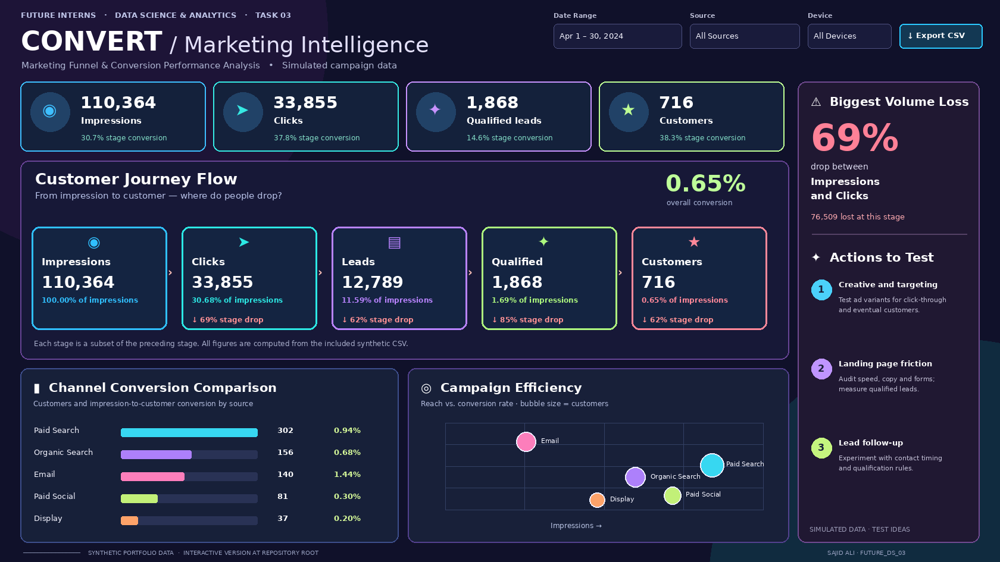

# CONVERT — Marketing Funnel & Conversion Performance Analysis

**Future Interns · Data Science & Analytics · Task 03**  
**Prepared by:** Sajid Ali  
**Repository name required by the internship:** `FUTURE_DS_03`

> The link works **after** publishing this repository to GitHub Pages from the `main` branch and `/ (root)`. The repository root contains `index.html`, so the live link opens the dashboard directly.

## Task goal

Analyze a marketing funnel to identify stage drop-offs, compare channels, and suggest experiments to improve lead-to-customer conversion. The dashboard visualizes impressions → clicks → leads → qualified leads → customers, with filterable metrics and channel comparisons.

**Data integrity:** The included data is **synthetic and generated for learning**, not observations from an actual company. Figures, dates, performance and recommendations must not be presented as real business outcomes. Currency is PKR for simulated marketing spend; funnel counts and conversion rates do not depend on currency.

## 📊 Interactive Dashboard Preview

<p align="center">
  <a href="https://sajidexpertise.github.io/FUTURE_DS_03/">
    
  </a>
</p>

<p align="center">
  <strong>
    <a href="https://sajidexpertise.github.io/FUTURE_DS_03/">
      🚀 Open the Live Interactive Dashboard
    </a>
  </strong>
</p>

## What is included

| File | Purpose |
|---|---|
| `index.html` | GitHub Pages entry point; opens the working dashboard |
| `dashboard/style.css`, `dashboard/app.js`, `dashboard/data.js` | Responsive dashboard, filter logic, and offline-compatible data |
| `dashboard/dashboard.png` | Shareable static overview rendered from the same April analysis figures |
| `data/campaign_funnel.csv` | Reproducible daily campaign and device segments, February–April 2024 |
| `generate_data.py` | Recreates CSV and `dashboard/data.js` deterministically |
| `analyze.py` | Validates stage ordering and generates analysis files |
| `render_preview.py` | Optionally regenerates the shareable dashboard PNG with Pillow |
| `reports/analysis.md`, `reports/analysis.json` | Findings, calculated losses and channel statistics |
| `OPEN_DASHBOARD.bat`, `RUN_ANALYSIS.bat` | Optional Windows launchers |

## Run it

1. Download this repository as a ZIP and extract it. Keep the folder structure.
2. Double-click **`index.html`** (or `OPEN_DASHBOARD.bat`). The included sample data loads without Python, a server, or an internet connection. Google Fonts enhance the typography when online; local fallback fonts also work.
3. Change **Date Range**, **Source**, or **Device**. Every KPI, funnel stage, leak, channel comparison, bubble chart and action idea recalculates for the selected records.
4. Click **Export CSV** to download only the currently filtered raw segments.

To regenerate data and reports with Python 3.9+, run `RUN_ANALYSIS.bat` on Windows, or:

```bash
python generate_data.py
python analyze.py
```

To regenerate the preview image too, install Pillow (`python -m pip install Pillow`) and run `python render_preview.py`. It is a static rendering of the April results; `index.html` is the interactive dashboard.

The `.bat` files are conveniences only. `OPEN_DASHBOARD.bat` opens the included dashboard; `RUN_ANALYSIS.bat` regenerates simulated CSV/JS, validates the funnel and updates the reports. Python scripts use only the standard library.

## Metric definitions

| Metric | Formula |
|---|---|
| Stage drop-off | `(previous stage − next stage) / previous stage` |
| Biggest volume loss | Stage transition with the highest **count** lost |
| Overall conversion | `customers / impressions` |
| Source conversion | `source customers / source impressions` |
| Period change | `(selected month − previous month) / previous month` using the same source and device filters |

All funnel stages are nested in every CSV row. February has no earlier month in this dataset, so no previous-month comparison is shown; “All available dates” has no meaningful equal-length comparison. Bubble sizes represent customers, X is impressions, and Y is overall conversion rate. The report's default selection is April 2024.

## Analysis and action

See [the generated analysis report](reports/analysis.md) for exact counts and ranking. The dashboard highlights the largest **absolute** stage loss, compares source conversion, and proposes tests around creative, landing experience and lead handling. These are suggested experiments, not proven causes. Assess results using downstream customers and cost as well as intermediate rates.

## Publish on GitHub Pages

1. Create a **public** GitHub repository named `FUTURE_DS_03` under `sajidexpertise`.
2. Upload **the extracted files and folders**, with `index.html` at repository root. Do not upload just the ZIP.
3. In **Settings → Pages**, select **Deploy from a branch → main → / (root)** and save.
4. When Pages reports deployment complete, visit [the live dashboard](https://sajidexpertise.github.io/FUTURE_DS_03/). Hard refresh if GitHub serves an earlier deployment.
5. Include the repository URL `https://github.com/sajidexpertise/FUTURE_DS_03` and your own LinkedIn post URL in the Future Interns submission portal when ready. Follow your offer letter's submission window.

This repository implements the Future Interns Task 3 deliverable: a marketing funnel analysis dashboard with evidence and actionable test ideas. It does not claim company endorsement, real-world campaign results or guaranteed improvements.
